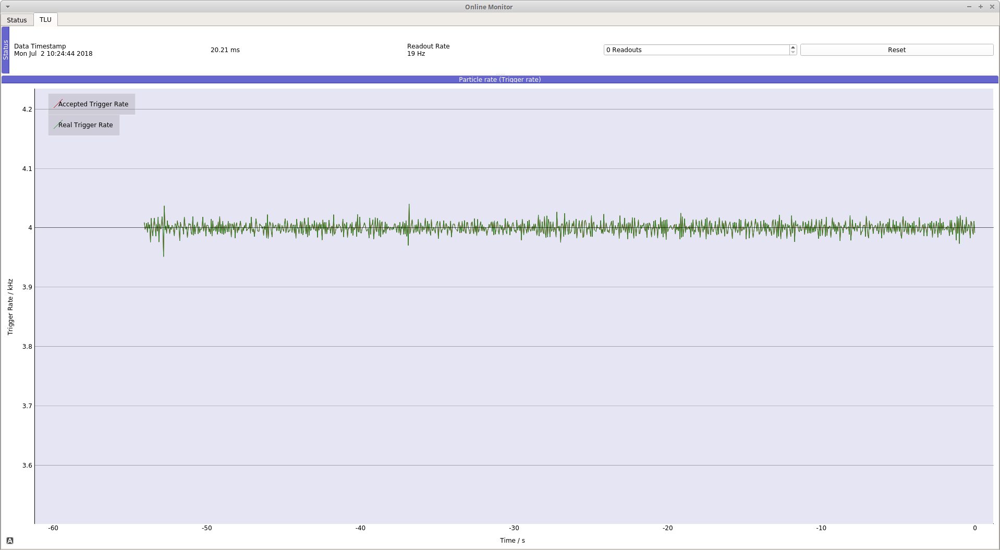

# pytlu

[](https://travis-ci.org/SiLab-Bonn/pytlu)

DAQ software and firmware for the EUDAQ [Trigger Logic Unit (TLU)](https://twiki.cern.ch/twiki/bin/view/MimosaTelescope/TLU).

## Description

The main features of the DAQ software and FPGA firmware are:

- Protocol compatible with original EUDAQ TLU firmware
- Integrated TDC (1.5625ns resolution, 640 MHz)
- Configurable input inversion
- Configurable input acceptance based on the pulse width
- Trigger acceptance based on the distance of the input pulse leading edge
- Continuous data storage of accepted triggers (trigger ID, timestamp, TDC)
- Testbench for software and firmware
- Example FPGA module provided by basil: [TLU/trigger FSM](https://github.com/SiLab-Bonn/basil/tree/master/firmware/modules/tlu)
- Data monitoring provided by the [online_monitor](https://github.com/SiLab-Bonn/online_monitor) package

The data of all accepted triggers will be stored in a HDF5/PyTables file. It contains the following data:

- Timestamp of the trigger (64-bit number, 40 MHz)
- Trigger ID (32-bit number)
- Distance between leading edge of input pulse and generation of trigger signal for each input channel (each of them 8-bit numbers)


## Online Monitor

The pytlu online monitor displays the trigger rate vs. time.


## Installation

Installation of [Anaconda Python](https://www.anaconda.com/download) or [Miniconda Python](https://conda.io/miniconda.html) is recommended.

Install dependencies:
```bash
conda install numpy psutil qtpy pyqt pyyaml pyzmq pytables
pip install pyusb pySiLibUSB
pip install 'basil_daq>=2.4.10,<3.0.0'
```

Install pytlu from PyPI:
```bash
pip install pytlu
```

OR install pytlu from sources:
```bash
python setup.py develop
```

For development/testing see [.travis.yml](https://github.com/SiLab-Bonn/pytlu/blob/master/.travis.yml) for details.

### USB Driver

Install libusb library by following the pySiLibUSB [installation guide](https://github.com/SiLab-Bonn/pySiLibUSB/wiki).

If you are using the TLU for the first time, you need to add a permanent udev rule in order to access the TLU. Create the file `/etc/udev/rules.d/tlu.rules` and add the following lines.
For a RedHat-based distribution (e.g., SL7/Centos 7) use:
```
SUBSYSTEM=="usb", ATTR{idVendor}=="165d", ATTR{idProduct}=="0001", GROUP="NOROOTUSB", MODE="0666"
```
OR for a Debian-based distribution (e.g., Ubuntu) use:
```
SUBSYSTEM=="usb", ATTR{idVendor}=="165d", ATTR{idProduct}=="0001", MODE="0666"
```

## Usage

In order to get a description of the possible input arguments run:
```bash
pytlu -h
```

In order to start pytlu online monitor run:
```bash
pytlu_monitor
```

Example:
```bash
pytlu -t 10000 -c 10000 -oe CH1 --timeout 2
```
